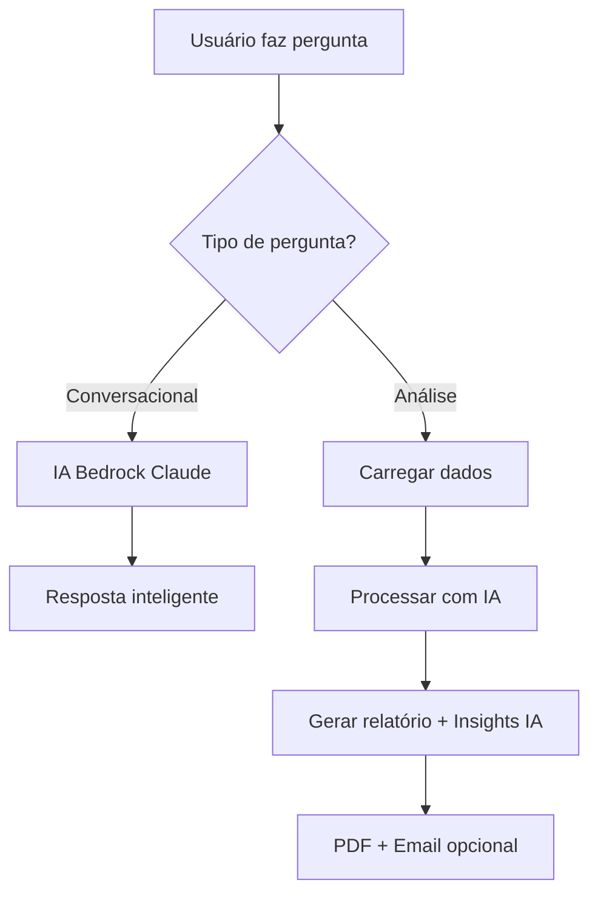

# 🤖 Guia do Agente de IA - Bedrock AgentCore

## 🎯 O que mudou?

Seu projeto agora é um **verdadeiro agente de IA** que usa:
- ✅ **Amazon Bedrock Claude 3 Sonnet** para respostas inteligentes
- ✅ **Conversação natural** com contexto dos dados
- ✅ **Análise automática** quando solicitada
- ✅ **Insights estratégicos** gerados por IA

## 🚀 Como usar o Agente de IA

### 1. **Modo Conversacional** (Nova funcionalidade)
```bash
python src/ai_chat_demo.py
```

**Exemplos de perguntas:**
- "Qual a situação atual das reclamações?"
- "Como posso melhorar o atendimento?"
- "Quais são os principais problemas?"
- "Que ações você recomenda?"

### 2. **Modo Servidor IA** (Recomendado)
```bash
python src/bedrock_ai_server.py
```
Inicia o agente como serviço Bedrock para integração com aplicações.

### 3. **Modo Análise Rápida** (Mantido)
```bash
python src/my_agent.py
python src/my_agent.py email@exemplo.com
```

## 🧠 Capacidades da IA

### **Conversação Inteligente**
- Responde perguntas sobre os dados
- Fornece insights contextualizados
- Sugere ações estratégicas
- Explica tendências e padrões

### **Análise Automática**
- Detecta quando gerar relatórios
- Cria insights com IA generativa
- Personaliza recomendações
- Integra dados com conhecimento bancário

### **Integração Bedrock**
- API REST para aplicações
- Runtime do Bedrock Agent
- Memória conversacional
- Observabilidade AWS

## 📊 Exemplos de Uso

### **Pergunta Conversacional:**
```
Usuário: "Por que temos tantas reclamações de cartão?"

IA: "Analisando os dados, identifiquei que 20% das reclamações 
são sobre cartão. Isso pode indicar problemas com:
- Sistema de aprovação
- Comunicação de limites
- Funcionalidades do app
Recomendo investigar os casos específicos e melhorar 
a comunicação proativa com clientes."
```

### **Comando de Análise:**
```
Usuário: "Analisar reclamações e gerar relatório"

IA: [Executa análise completa]
- Gera PDF com gráficos
- Cria insights estratégicos com IA
- Calcula métricas importantes
- Sugere ações específicas
```

## 🔧 Configuração AWS

### **Configuração no .env:**
```bash
cp .env.example .env
# Edite o .env com suas credenciais:
```

```env
AWS_ACCESS_KEY_ID=sua_access_key
AWS_SECRET_ACCESS_KEY=sua_secret_key
AWS_DEFAULT_REGION=us-east-1
```

### **Permissões necessárias:**
- `bedrock:InvokeModel`
- `bedrock-agentcore:*`

## 🎛️ Configurações Avançadas

### **Modelo de IA:**
No arquivo `src/my_agent.py`:
```python
modelId='amazon.nova-micro-v1:0'
```

**Modelo configurado:**
- `amazon.nova-micro-v1:0` (até 128K contexto)
- Otimizado para análise de dados
- Respostas rápidas e precisas

### **Personalizar Prompts:**
Edite a função `get_ai_response()` para ajustar o comportamento da IA.

## 🔄 Fluxo de Funcionamento



## 📈 Vantagens do Agente de IA

### **Antes (Script):**
- ❌ Apenas processamento de dados
- ❌ Insights fixos e limitados
- ❌ Sem interação conversacional
- ❌ Relatórios padronizados

### **Agora (Agente IA):**
- ✅ **Conversação natural** com dados
- ✅ **Insights dinâmicos** gerados por IA
- ✅ **Recomendações personalizadas**
- ✅ **Integração com Bedrock**
- ✅ **Escalabilidade empresarial**

## 🚀 Próximos Passos

1. **Testar conversação:** `python src/ai_chat_demo.py`
2. **Iniciar servidor:** `python bedrock_ai_server.py`
3. **Integrar com aplicações** via API Bedrock
4. **Personalizar prompts** para seu negócio
5. **Adicionar mais fontes de dados**

## 🔍 Troubleshooting

### **Erro de credenciais AWS:**
```bash
aws configure list
aws sts get-caller-identity
```

### **Modelo não disponível:**
Verifique se o modelo Claude está habilitado na sua região AWS.

### **Dados não encontrados:**
Certifique-se que `reclamacoes_20251001_220605.json` existe no diretório.

---

**🎉 Parabéns! Agora você tem um verdadeiro agente de IA conversacional!**