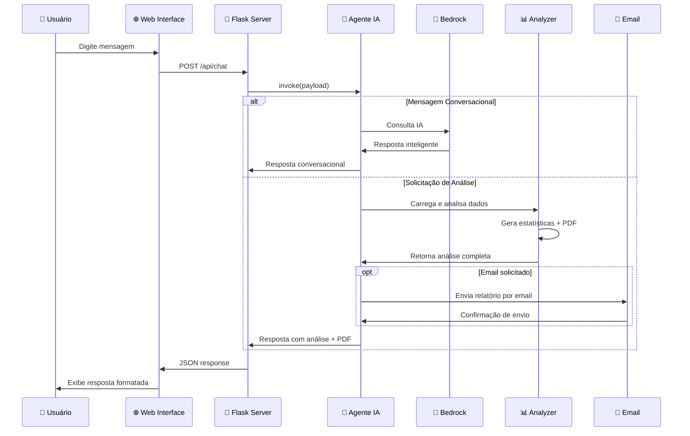

# Arquitetura e Fluxo da Aplicação - Agente IA Sicredi

## Fluxo Principal da Aplicação

```mermaid
graph TD
    A[👤 Usuário] --> B[🌐 Interface Web<br/>chat.html]
    B --> C[📡 Flask Server<br/>web_chat.py]
    C --> D{🤖 Tipo de Mensagem?}
    
    D -->|Conversacional| E[💬 Resposta IA<br/>get_ai_response()]
    D -->|Análise| F[📊 Análise Completa<br/>invoke()]
    
    E --> G[🧠 Amazon Bedrock<br/>Claude Nova Micro]
    G --> H[📤 Resposta Conversacional]
    
    F --> I[📁 Carrega Dados<br/>data/reclamacoes.json]
    I --> J[🔍 Analyzer.py<br/>Processa Dados]
    J --> K[📈 Gera Insights<br/>+ PDF Report]
    K --> L{📧 Email Solicitado?}
    
    L -->|Sim| M[📮 EmailSender<br/>Envia Relatório]
    L -->|Não| N[📋 Retorna Análise]
    
    M --> N
    H --> O[🖥️ Exibe no Chat]
    N --> O
    
    style A fill:#e1f5fe
    style G fill:#fff3e0
    style J fill:#f3e5f5
    style M fill:#e8f5e8
```

## Componentes Principais

### 1. **Frontend (chat.html)**
- Interface web responsiva
- Chat em tempo real
- Download de PDFs
- Comunicação via AJAX

### 2. **Web Server (web_chat.py)**
- Servidor Flask
- API REST `/api/chat`
- Rota de download `/download/<filename>`
- Gerenciamento de sessões

### 3. **Agente IA (my_agent.py)**
- **Bedrock AgentCore** - Framework principal
- **Amazon Bedrock** - IA generativa (Claude Nova Micro)
- Lógica conversacional vs análise
- Processamento inteligente de mensagens

### 4. **Análise de Dados (analyzer.py)**
- Carregamento de dados JSON
- Análise estatística (categorias, status, trends)
- Geração de gráficos (matplotlib)
- Criação de relatórios PDF (ReportLab)

### 5. **Envio de Email (email_sender.py)**
- Integração com Gmail SMTP
- Anexo de relatórios PDF
- Configuração via .env

## Fluxo de Dados



## Tecnologias Utilizadas

### **Backend:**
- **Python 3.13+**
- **Flask** - Web framework
- **Bedrock AgentCore** - Framework de agentes IA
- **boto3** - SDK AWS
- **pandas** - Análise de dados
- **matplotlib/seaborn** - Visualizações
- **ReportLab** - Geração de PDFs

### **Frontend:**
- **HTML5/CSS3/JavaScript**
- **Fetch API** - Comunicação assíncrona
- **Responsive Design**

### **Serviços AWS:**
- **Amazon Bedrock** - IA Generativa
- **Claude Nova Micro** - Modelo de linguagem

### **Integrações:**
- **Gmail SMTP** - Envio de emails
- **JSON** - Formato de dados
- **PDF** - Relatórios

## Estrutura de Arquivos

```
DesafioAgentCore/
├── src/
│   ├── my_agent.py          # 🤖 Agente principal + Bedrock
│   ├── analyzer.py          # 📊 Análise de dados + PDF
│   ├── email_sender.py      # 📧 Envio de emails
│   └── ai_chat_demo.py      # 💬 Chat terminal (opcional)
├── templates/
│   └── chat.html            # 🌐 Interface web
├── data/
│   └── reclamacoes_*.json   # 📁 Dados de entrada
├── results/
│   └── relatorio_*.pdf      # 📋 Relatórios gerados
├── web_chat.py              # 📡 Servidor Flask
├── requirements.txt         # 📦 Dependências
└── .env                     # 🔐 Configurações
```

## Como Criar Diagramas

### **Opção 1: Mermaid (Recomendado)**
```bash
# Instalar Mermaid CLI
npm install -g @mermaid-js/mermaid-cli

# Gerar diagrama
mmdc -i architecture_flow.md -o diagrama.png
```

### **Opção 2: Draw.io**
1. Acesse [draw.io](https://app.diagrams.net/)
2. Use os elementos do diagrama acima
3. Exporte como PNG/SVG

### **Opção 3: PlantUML**
```bash
# Instalar PlantUML
pip install plantuml

# Criar arquivo .puml com o diagrama
# Gerar imagem
python -m plantuml diagrama.puml
```

## Métricas da Aplicação

- **Latência**: ~2-5s (análise completa)
- **Throughput**: Suporta múltiplas sessões
- **Dados**: ~20 reclamações de exemplo
- **Formatos**: JSON → PDF + Email
- **IA**: Claude Nova Micro (Amazon Bedrock)