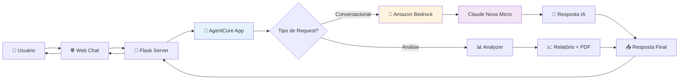

# Como Bedrock AgentCore e Amazon Bedrock são Utilizados

## 1. **Bedrock AgentCore** - Framework de Agentes

### **Função no Projeto:**
O Bedrock AgentCore é o **framework principal** que estrutura o agente de IA.

### **Implementação em `my_agent.py`:**

```python
from bedrock_agentcore import BedrockAgentCoreApp

# Criação da aplicação do agente
app = BedrockAgentCoreApp()

@app.entrypoint
def invoke(payload):
    """Ponto de entrada principal do agente"""
    user_message = payload.get("prompt", "")
    # Lógica do agente aqui...
    return response
```

### **O que o AgentCore faz:**
- **Estrutura o agente** como uma aplicação
- **Define o ponto de entrada** (`@app.entrypoint`)
- **Gerencia o ciclo de vida** do agente
- **Padroniza a interface** de entrada/saída
- **Facilita integração** com outros serviços AWS

### **Benefícios:**
- ✅ **Padronização** - Interface consistente
- ✅ **Escalabilidade** - Pronto para produção
- ✅ **Integração** - Funciona com AWS Lambda, ECS, etc.
- ✅ **Monitoramento** - Logs e métricas automáticas

---

## 2. **Amazon Bedrock** - IA Generativa

### **Função no Projeto:**
Amazon Bedrock fornece a **inteligência artificial** para conversação e análise.

### **Implementação em `my_agent.py`:**

```python
import boto3
import json

# Cliente Bedrock
bedrock_client = boto3.client('bedrock-runtime', region_name='us-east-1')

def get_ai_response(user_message, context_data=None):
    """Gera resposta inteligente usando Claude Nova Micro"""
    
    # Prompt do sistema
    system_prompt = """
    Você é um assistente do Sicredi especializado em análise de reclamações.
    Seja conversacional, direto e ATENTO aos detalhes da pergunta.
    """
    
    # Chamada para o modelo
    response = bedrock_client.invoke_model(
        modelId='amazon.nova-micro-v1:0',  # Claude Nova Micro
        body=json.dumps({
            "messages": [{
                "role": "user",
                "content": [{"text": f"{system_prompt}\n\nPergunta: {user_message}"}]
            }],
            "inferenceConfig": {
                "max_new_tokens": 1000,
                "temperature": 0.7
            }
        })
    )
    
    # Processar resposta
    response_body = json.loads(response['body'].read())
    return response_body['output']['message']['content'][0]['text']
```

### **Modelo Utilizado:**
- **Claude Nova Micro** (`amazon.nova-micro-v1:0`)
- **Região:** us-east-1
- **Configuração:** Temperature 0.7, Max tokens 1000

---

## 3. **Fluxo de Integração**



---

## 4. **Configuração AWS**

### **Credenciais (`.env`):**
```env
AWS_ACCESS_KEY_ID=sua_access_key
AWS_SECRET_ACCESS_KEY=sua_secret_key
AWS_DEFAULT_REGION=us-east-1
```

### **Permissões IAM Necessárias:**
```json
{
    "Version": "2012-10-17",
    "Statement": [
        {
            "Effect": "Allow",
            "Action": [
                "bedrock:InvokeModel",
                "bedrock:InvokeModelWithResponseStream"
            ],
            "Resource": [
                "arn:aws:bedrock:us-east-1::foundation-model/amazon.nova-micro-v1:0"
            ]
        }
    ]
}
```

---

## 5. **Fallback Strategy**

### **Quando Bedrock não está disponível:**
```python
def get_rule_based_response(user_message, context_data=None):
    """Respostas baseadas em regras quando Bedrock falha"""
    msg_lower = user_message.lower()
    
    if 'categoria' in msg_lower:
        return "📊 Principais categorias: App, Cartão, PIX..."
    
    if 'situação' in msg_lower:
        return "📈 Situação atual das reclamações..."
    
    return "🤖 Como posso ajudar com análise de reclamações?"
```

### **Estratégia de Resilência:**
1. **Primeiro:** Tenta Amazon Bedrock
2. **Fallback:** Usa respostas baseadas em regras
3. **Sempre:** Mantém funcionalidade básica

---

## 6. **Vantagens da Arquitetura**

### **Bedrock AgentCore:**
- 🏗️ **Estrutura robusta** para agentes
- 🔄 **Ciclo de vida gerenciado**
- 📊 **Monitoramento integrado**
- 🚀 **Deploy simplificado**

### **Amazon Bedrock:**
- 🧠 **IA de última geração** (Claude Nova Micro)
- ⚡ **Baixa latência** (~1-2s)
- 🔒 **Segurança enterprise**
- 💰 **Pay-per-use**

### **Combinação:**
- ✅ **Agente inteligente** estruturado
- ✅ **Conversação natural** com IA
- ✅ **Análise de dados** automatizada
- ✅ **Escalabilidade** para produção

---

## 7. **Exemplo de Uso Completo**

### **Input do Usuário:**
```
"Qual categoria tem mais reclamações?"
```

### **Fluxo:**
1. **Web Chat** → Flask Server
2. **Flask** → AgentCore (`invoke()`)
3. **AgentCore** → Carrega dados + contexto
4. **AgentCore** → Amazon Bedrock (Claude)
5. **Claude** → Analisa pergunta + dados
6. **Claude** → Resposta: "App é a categoria com mais reclamações (35%)"
7. **AgentCore** → Retorna resposta estruturada
8. **Flask** → Web Chat
9. **Web Chat** → Exibe para usuário

### **Resultado:**
```
🎯 CATEGORIA COM MAIS RECLAMAÇÕES:
• App: 7 casos (35.0%)
• Requer atenção imediata
• Categoria mais problemática identificada
```

---

## 8. **Monitoramento e Logs**

### **AgentCore Logs:**
- Entrada/saída de requests
- Tempo de processamento
- Erros e exceções

### **Bedrock Metrics:**
- Número de invocações
- Latência média
- Tokens consumidos
- Custos por request

Esta arquitetura combina o **melhor dos dois mundos**: estrutura robusta do AgentCore + inteligência avançada do Bedrock!